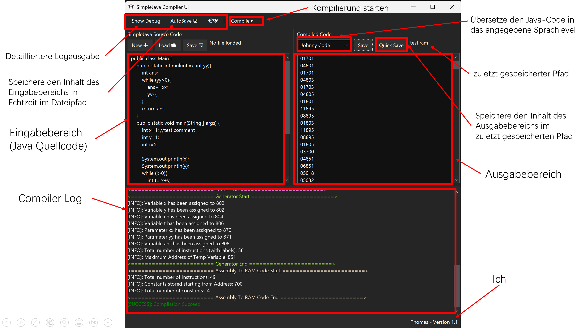
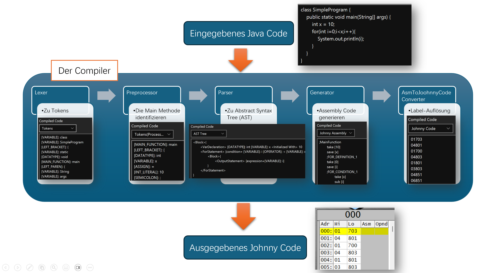
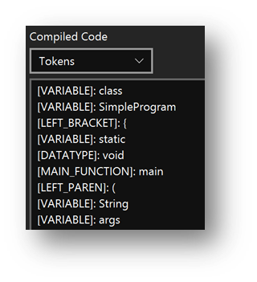
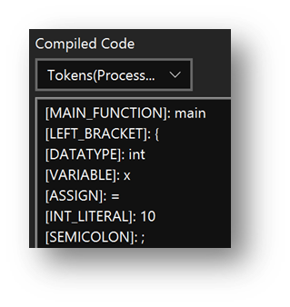
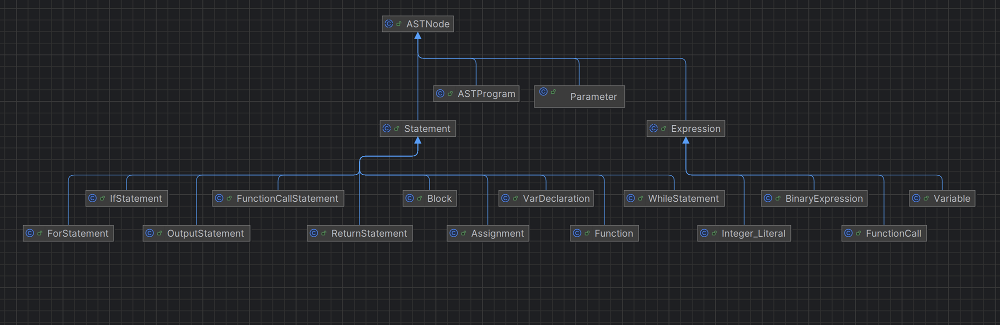
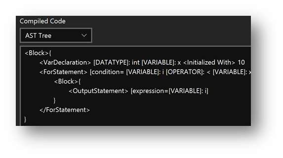
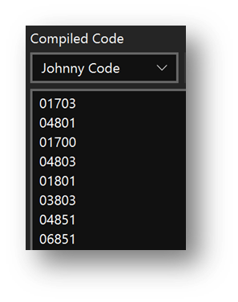
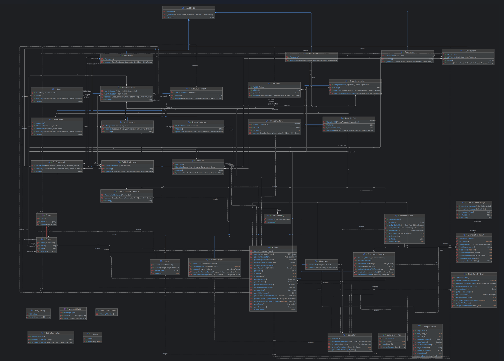

# Simple Java: Projekt Dokumentation (Übersetzung aus dem Englischen)

# Inhaltsverzeichnis

- [Einleitung](#einleitung)
- [1 Compiler-Funktionen](#1-compiler-funktionen)
  - [1.1 Gesamtübersicht](#11-gesamtübersicht)
    - [1.1.1 Unterstützte Funktionen](#111-unterstützte-funktionen)
    - [1.1.2 Nicht unterstützte Funktionen](#112-nicht-unterstützte-funktionen)
  - [1.2 Erweiterter Befehlssatz](#12-erweiterter-befehlssatz)
  - [1.3 Compiler-Log](#13-compiler-log)
  - [1.4 SimpleJava-Teilmenge](#14-simplejava-teilmenge)
    - [1.4.1 Gesamtstruktur](#141-gesamtstruktur)
    - [1.4.2 Datentypen](#142-datentypen)
    - [1.4.3 Ausdrücke und Operatoren](#143-ausdrücke-und-operatoren)
    - [1.4.4 Anweisungen](#144-anweisungen)
    - [1.4.5 Beispiel](#145-beispiel)
- [2 Verwendung](#2-verwendung)
- [3 Compiler-Interna](#3-compiler-interna)
  - [3.1 Überblick über den Übersetzungsprozess](#31-überblick-über-den-übersetzungsprozess)
  - [3.2 Lexer](#32-lexer)
  - [3.3 Preprocessor](#33-preprocessor)
  - [3.4 Parser](#34-parser)
  - [3.5 Generator](#35-generator)
  - [3.6 AsmToJohnny](#36-asmtojohnny)
- [4 Speicherverwaltung](#4-speicherverwaltung)
- [5 Klassendiagramme](#5-Klassendiagramme)
- [6 Projektstatistiken](#6-projektstatistiken)


# Einleitung (Probleme und Ziele)

Die ursprüngliche Motivation für die Entwicklung dieses Compiler-Projekts stammt aus meiner Erfahrung mit der Software „johnny“ in der Schule zur Simulation von Assemblerprogrammen. Während ich mit johnny lernte, wurde mir klar, dass es mir nicht half, mein Wissen über Hochsprachen und Low-Level-Programmiersprachen zu verknüpfen – insbesondere habe ich nie wirklich verstanden, wie eine Sprache wie Java in Maschinencode umgewandelt wird. Ich stellte mir ein Tool vor, das die im Unterricht behandelten Java-Programme in johnny-Assemblercode übersetzen kann, damit die Schüler beim Lernen einer Hochsprache gleichzeitig auch die Prinzipien der zugrunde liegenden Maschinenoperationen verstehen.

Daraus entstand mein Entschluss, die Grundlagen der Compilerbauweise zu lernen und einen Compiler zu entwickeln, der Java-Code in ein Format übersetzt, das johnny versteht. Da Java komplex ist und johnny-Assembly nur eingeschränkte Möglichkeiten bietet, liegt der Schwerpunkt dieses Compilers eher auf dem grundlegenden Verständnis der Übersetzung an sich und weniger auf der Unterstützung vollwertiger objektorientierter Projekte.


# 1 Compiler-Funktionen

Dieser Compiler wurde in Java implementiert und ist darauf ausgelegt, einfache Java-Programme zu übersetzen. Seine Fähigkeiten umfassen:

## 1.1 Gesamtübersicht

### 1.1.1 Unterstützte Funktionen
- **Einfache Variablendeklaration:**  
  Erlaubt die Deklaration von Variablen des Typs int.
- **Deklaration mit Initialisierung:**  
  Variablen können bei der Deklaration direkt einen Wert zugewiesen bekommen.
- **Zuweisungsanweisungen:**  
  Standardmäßige Zuweisungsoperationen werden unterstützt.
- **Bedingte Anweisungen:**  
  if-Anweisungen werden unterstützt.
- **Schleifenkonstrukte:**  
  while-Schleifen werden unterstützt.
- **Funktionsdefinitionen und einfache Funktionsaufrufe:**  
  Funktionen werden ***über einen erweiterten Befehlssatz bereitgestellt.***
- **Ausdrucksauswertung:**  
  Ausdrücke werden mit korrekter Operator-Priorität ausgewertet.
- **Ausgabe:**  
  ***Über den erweiterten Befehlssatz möglich***.

### 1.1.2 Nicht unterstützte Funktionen
- Zahlen dürfen 999 nicht überschreiten.
- Negative Zahlen und Dezimalzahlen werden nicht unterstützt.
- Variablennamen müssen eindeutig sein (sogar zwischen main und Funktionsbereichen).
- Andere binäre Operationen als Addition und Subtraktion (z. B. Multiplikation und Division) werden nicht unterstützt (können jedoch über Funktionen simuliert werden).
- Klassen und Objekte werden nicht unterstützt.
- Datentypen wie string, char, float, double und boolean werden nicht unterstützt.
- Mehrfachdeklarationen von Variablen in einer Zeile werden nicht unterstützt.
- Funktionsaufrufe innerhalb von Funktionen (einschließlich Rekursion) werden nicht unterstützt.
- Komplexe Datenstrukturen, mehrteilige Projekte und erweiterte Syntaxprüfungen sind nicht unterstützt.


## 1.2 Erweiterter Befehlssatz

Zwei zusätzliche Befehle erweitern den Basis-Befehlssatz:
- **savi addr:**  
  Erweiterung des ursprünglichen `save`-Befehls. Speichert den Wert eines Registers in die durch `addr` angegebene Speicheradresse.
- **jmpi addr:**  
  Erweiterung des ursprünglichen `jmp`-Befehls. Springt zu der durch `addr` angegebenen Speicheradresse.

## 1.3 Compiler-Log

Der Compiler erzeugt während der Übersetzung detaillierte Logs, hauptsächlich zur Fehlersuche. Diese Logs umfassen:
- Daten aus jedem Übersetzungsabschnitt (z. B. Anzahl verarbeiteter Zeilen, definierte Variablen, Speicherbelegungsinformationen).
- Fehlermeldungen, die die Gründe für Übersetzungsabbrüche erklären (ohne spezifische Zeilennummern).

## 1.4 SimpleJava-Teilmenge (Was genau der Compiler unterstützt)

### 1.4.1 Gesamtstruktur
- **Eine Klasse pro Programm:**  
  Jedes Programm muss in einer einzigen Klasse geschrieben werden und über eine `main`-Methode als Einstiegspunkt verfügen, mit der festen Signatur:
  ```java
  public static void main() { 
      // ...
  }
  ```
- **Statische Methoden:**  
  Zusätzlich zu `main` können weitere statische Methoden definiert werden:
    - Sie müssen einen int zurückgeben.
    - Sie dürfen nur int-Parameter verwenden.
    - Method Overloading wird nicht unterstützt.
  ```java
  public static int multiply(int a, int b) {
      int result = 0;
      while (b > 0) {
          result = result + a;
          b = b - 1;
      }
      return result;
  }
  ```
- **Klassenvariablen:**  
  Klassenvariablen sind zwar erlaubt, jedoch unterstützt die Sprache keine objektorientierten Funktionen wie Objekte, Membervariablen, Vererbung oder Polymorphie.
- **Exception Handling:**  
  Keine try/catch/finally-Strukturen vorhanden.
- **Rekursion:**  
  Rekursive Funktionsaufrufe sind nicht unterstützt.

### 1.4.2 Datentypen
- **Nur Ganzzahldatentyp:**  
  Der einzige unterstützte Datentyp ist `int`.
- **Booleans:**  
  Booleans werden durch int dargestellt: 0 bedeutet false, jeder andere Wert bedeutet true.
- **Nicht unterstützte Typen:**  
  Es gibt keine Unterstützung für `String`, Arrays, Gleitkommazahlen, Objekte oder andere Datentypen.

### 1.4.3 Ausdrücke und Operatoren
- **Arithmetische Operatoren:**  
  Unterstützt werden `+` und `-`.
- **Vergleichsoperatoren:**  
  Unterstützt werden `==`, `!=`, `<`, `>`, `<=` und `>=`. Sie werden in bedingten Ausdrücken benutzt; das Ergebnis wird als int gespeichert (0 oder 1).
- **Klammern:**  
  Klammern können verwendet werden, um die Ausführungsreihenfolge zu beeinflussen.
- **Funktionsaufrufe:**  
  Statische Methoden können in Ausdrücken aufgerufen werden. Alle Parameter müssen vom Typ `int` sein, und der Rückgabewert muss `int` sein.

### 1.4.4 Anweisungen
Die Sprache unterstützt folgende Anweisungstypen:
- **Variablendeklarationen:**  
  Nur int-Variablen können deklariert werden, optional mit Initialisierung:
  ```java
  int a;
  int b = 10;
  ```
- **Zuweisungsanweisungen:**  
  Zum Beispiel:
  ```java
  a = 5;
  a = a + 3;
  ```
- **Bedingte Anweisungen (in Entwicklung):**  
  if-else-Strukturen werden unterstützt:
  ```java
  if (a < 10) {
      a = a + 1;
  } else {
      a = a - 1;
  }
  ```
- **Schleifenanweisungen (in Entwicklung):**  
  Nur while-Schleifen sind unterstützt:
  ```java
  while (a != 0) {
      a = a - 1;
  }
  ```
- **Funktionsaufrufe (in Entwicklung):**  
  Statische Methoden können aufgerufen werden:
  ```java
  foo(3, a);
  ```
- **Return-Anweisungen (in Entwicklung):**  
  In statischen Methoden (außer main) muss ein int-Wert zurückgegeben werden:
  ```java
  return a + b;
  ```

### 1.4.5 Beispiel
```java
class SimpleProgram {
  public int mul(int a, int b) {
    int result = 0;
    while (b > 0) {
      result += a;
      b--;
    }
    return result;
  }
  public static void main(String[] args) {
    int x = 10;

    for(int i=0;i<x;i++){
      System.out.println(mul(i,2));
    }
  }
}
```

# 2 Verwendung



# 3 Compiler-Interna

Der Compiler zerlegt das Eingabeprogramm in mehreren Stufen in eine immer niedrigere Abstraktionsebene, bis letztlich Maschinencode entsteht, den johnny verarbeiten kann.

## 3.1 Überblick über den Übersetzungsprozess

Das Eingabeprogramm wird durch eine Reihe von Umwandlungen geführt, bei denen es schrittweise in einfachere Formen aufgespalten wird.

## 3.2 Lexer

Der Lexer wandelt das Eingabeprogramm in eine Folge von Tokens um (Schlüsselwörter, Operatoren, Bezeichner usw.) und verwirft dabei irrelevante Elemente wie Leerzeichen und Zeilenumbrüche.

## 3.3 Preprocessor

Der Preprocessor bereinigt den Token-Strom. Da der Compiler keine Klassenstrukturen unterstützt, entfernt er Klassenkonstrukte und identifiziert den Einsprungpunkt (die main-Funktion) im Programm.

## 3.4 Parser

Der Parser erzeugt aus dem Token-Strom einen Abstract Syntax Tree (AST).  
*Erklärung AST:* Ein Abstract Syntax Tree ist eine hierarchische Darstellung des Programms, in der die syntaktischen Beziehungen zwischen den Code-Elementen deutlich werden. Er erleichtert die weitere Analyse und Code-Generierung.  
**Die Struktur (IntelliJ UML Diagram):**

Bei Funktionen erfolgt ein zweiter Parsing-Durchlauf, um Definitionen zu finden und zu verarbeiten – dieser spezielle Vorgang stellt sicher, dass alle Funktionskonstrukte korrekt eingearbeitet werden. Das Parsing ist rekursiv aufgebaut, sodass auch geschachtelte Strukturen problemlos verarbeitet werden können.

## 3.5 Generator

Der Generator durchläuft den AST und erzeugt Assembly-Code. Wichtige Aspekte sind:
- **Label-Verwendung:**  
  Anstelle von direkten Speicheradressen werden Labels genutzt, um die Lesbarkeit und Fehlersuche zu erleichtern. Anschließend werden diese Labels in konkrete Adressen aufgelöst.
- **Rekursive Code-Generierung:**  
  Jeder AST-Knoten implementiert eine Methode `generate()`, die rekursiv Code erzeugt.
- **Konstantenverwaltung:**  
  Während des Parsings gefundene Konstanten werden erfasst und später in einem eigenen Speicherbereich abgelegt.
- **Funktionsgenerierung:**
    - Funktionsdefinitionen werden erzeugt und nach der main-Funktion angehängt.
    - Beim Aufruf einer Funktion wird die aktuelle Zeilennummer in einem festen Register gespeichert, bevor in die Funktion verzweigt wird.
    - Eine Funktion gibt ihren Wert zurück, indem sie ihn in ein bestimmtes Register schreibt und dann per `jmpi` zurückspringt.
    - Funktionsparameter werden in einem speziellen Speicherbereich abgelegt.
- **Temporäre Variablen:**  
  Zur Auswertung von Ausdrücken benötigt man Hilfsvariablen. Dessen Adressen können wiederverwendet werden, sobald die jeweiligen Zwischenergebnisse nicht mehr benötigt werden.

## 3.6 AsmToJohnny

Nach der Code-Generierung wird der Assembly-Code vom AsmToJohnny Converter in johnny-kompatiblen Maschinencode übersetzt:
- **Label-Auflösung:**  
  Der Converter durchläuft den Assembly-Code mehrfach, um alle Labels korrekt zuzuordnen.
- **Besondere Label-Behandlung:**
    - Befindet sich auf einer Zeile nur ein Label (ohne Code), wird dieses an das Ende der folgenden Zeile verschoben, damit die Zeilennummerierung stimmt.
    - Spezielle Labels, wie etwa solche für „aktuelle Zeile plus drei“ (`THIS_LINE_PLUS_THREE`) oder solche, die auf feste Register zeigen, erfordern eine gesonderte Behandlung.

# 4 Speicherverwaltung

Der Compiler teilt den Speicher in mehrere Bereiche ein, die jeweils unterschiedliche Zwecke erfüllen. Die Aufteilung sieht folgendermaßen aus:
  (Diese können in der Datei `MemorzAllocation` konfiguriert werden)
- **0–600: Programmbereich**  
  Enthält den kompilierten Programmcode.
- **600–800: Konstantenbereich**  
  Speichert Zahlenkonstanten, die während der Programmausführung benötigt werden.
- **801–850: Variablenbereich**  
  Enthält die im Quellcode definierten Variablen.
- **851–870: Bereich für temporäre Variablen**  
  Speichert Zwischenergebnisse während der Ausdrucksauswertung.
- **871–890: Funktionsparameterbereich**  
  Ausschließlich für die Übergabe von Parametern an Funktionen reserviert.
- **891–899: Bereich für feste Zeiger/Register**  
  Reserviert für spezielle Zeiger und Register, die für Funktionsaufrufe und festgelegte Operationen gebraucht werden.  
  Wichtige Adressen in diesem Bereich:
    - `OUTPUT_PointerAddress = 895`
    - `PARAMETER_PointerAddress = 896`
    - `RETURN_PointerAddress = 897`
    - `FUNCTION_Result_Address = 898`
    - `ERROR_DefaultAddress = 899`
- **900–949: Eingabebereich**  
  Reserviert für Eingabedaten.
- **950–999: Ausgabebereich**  
  Reserviert für Ausgabedaten.
# 5 Klassendiagramme
## IntelliJ UML Diagram
siehe `/docs/Class Diagram/Class Diagram.svg`

# 6 Projektstatistiken

- Gesamtzeilen Code: 3778
- Anteil Quellcodezeilen: 72 % (~36% von ChatGPT, ~64% von Thomas Lu)
- Anteil Kommentarzeilen: 12 %
- Anteil Leerzeilen: 16 %  
- ## Überblicks-Roadmap

|                      | Lexer | Preprocessor | Parser | Generator | Assembly To Johnny |
|----------------------|:-----:|:------------:|:------:|:---------:|:------------------:|
| Var Declaration      |   ✅   |      ✅       |   ✅    |     ✅     |         ✅          |
| Var Computation      |   ✅   |      ✅       |   ✅    |     ✅     |         ✅          |
| Computation Priority |   ✅   |      ✅       |   ✅    |     ✅     |         ✅          |
| Domain               |   ✅   |      ✅       |   ✅    |     ✅     |         ✅          |
| Input                |   ❌   |      ❌       |   ❌    |     ❌     |         ❌          |
| Output               |   ✅   |      ✅       |   ✅    |     ✅     |         ✅          |
| IF Statement         |   ✅   |      ✅       |   ✅    |     ✅     |         ✅          |
| While Loop           |   ✅   |      ✅       |   ✅    |     ✅     |         ✅          |
| For Loop             |   ✅   |      ✅       |   ✅    |     ✅     |         ✅          |
| Function             |   ✅   |      ✅       |   ✅    |     ✅     |         ✅          |
| Boolean              |   ❌   |      ❌       |   ❌    |     ❌     |         ❌          |
| Variable Name Domain |   ❌   |      ❌       |   ❌    |     ❌     |         ❌          |

# 7 Danksagung
Vielen Dank an GPT, das meine Entwicklungseffizienz erheblich gesteigert hat. Ich muss mich nicht mehr mit der Implementierung der GUI-Oberfläche beschäftigen – Aufgaben, die früher mindestens ein paar Tage gedauert hätten, kann ich jetzt in nur einer halben Stunde erledigen, sodass ich mich ganz auf die Implementierung des Compilers konzentrieren kann. Und ein Dankeschön auch für die Übersetzung des kawaii Easter-Egg-modus von GPT.
